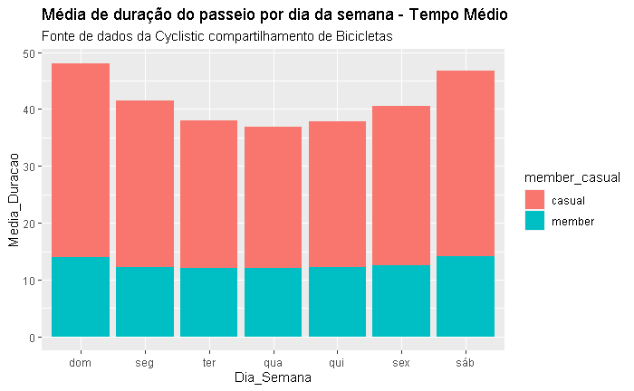
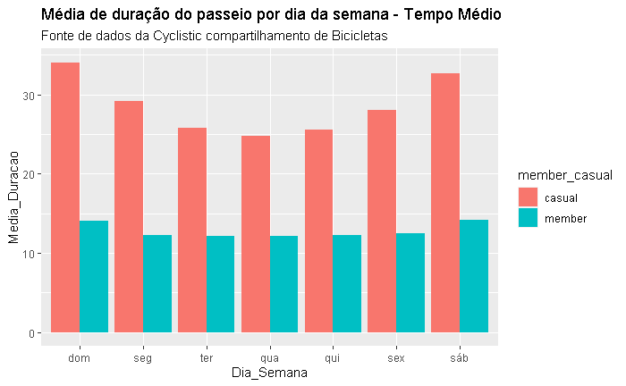
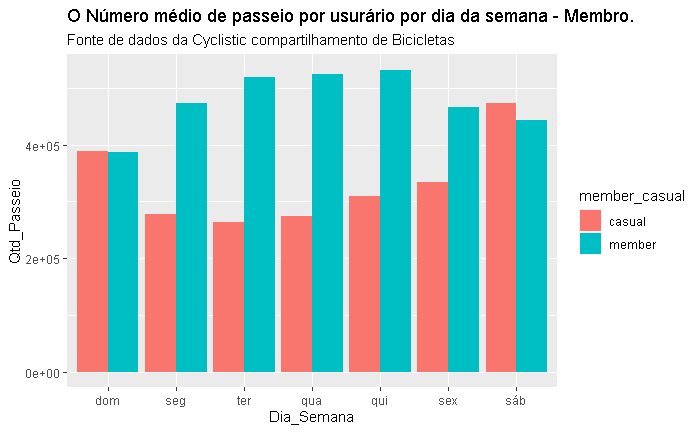
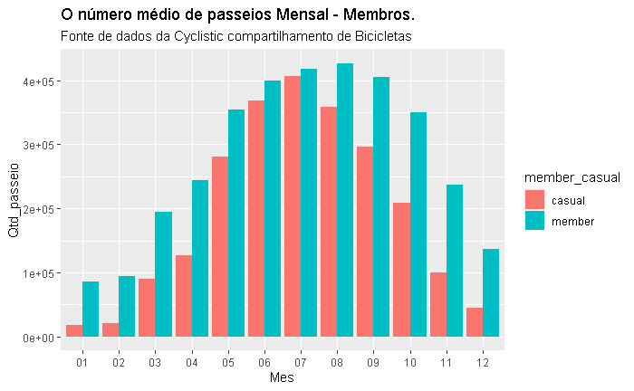
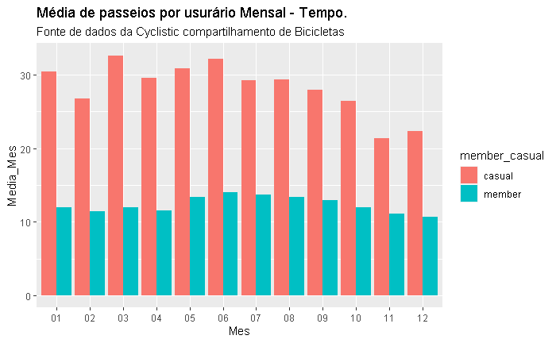
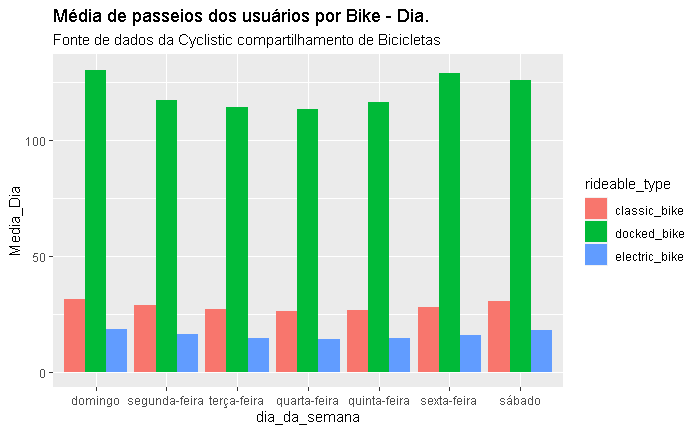
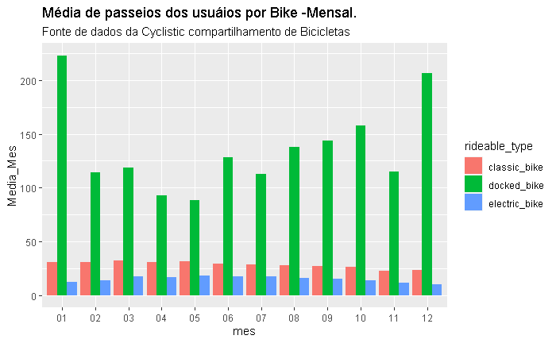
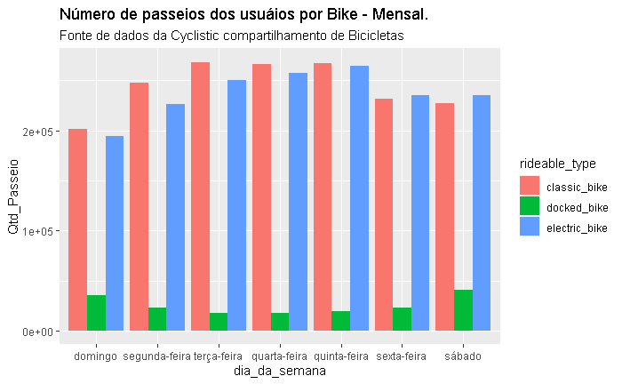
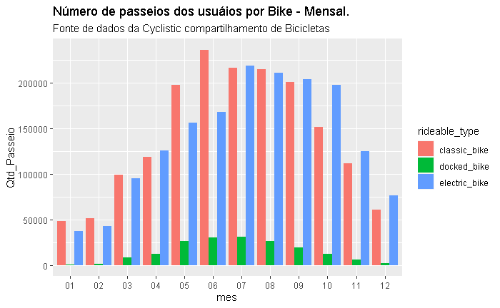
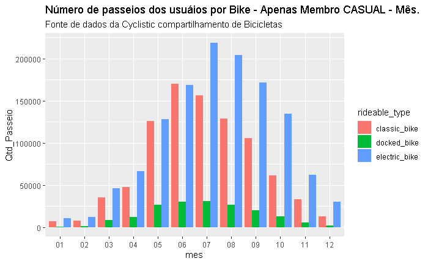

# Estudo de caso: Análise de bicicletas compartilhadas da Cyclistic

### Fabiano Fernandes

### Data da última atualização: 09/08/2023

## Cyclistic R Markdown

## Cenário

Você é um analista de dados júnior que trabalha na equipe de analistas de marketing da Cyclistic, uma empresa de compartilhamento de bicicletas em Chicago. O diretor de marketing acredita que o sucesso futuro da empresa depende da maximização do número de planos anuais contratados. Portanto, sua equipe quer entender como os ciclistas casuais e os membros anuais usam as bicicletas da Cyclistic de forma diferente. A partir desses insights, sua equipe criará uma nova estratégia de marketing para converter passageiros casuais em membros anuais. Mas, primeiro, os executivos da Cyclistic devem aprovar suas recomendações que, portanto, devem ser apoiadas com insights de dados convincentes e visualizações de dados profissionais.

## Personagens e Produtos

### Personagens

- Cyclistic: Empresa de Compartilhamento de Bibicletas
- Lily Morenor: Diretora de marketing. Lily é responsável pelo desenvolvimento de campanhas e iniciativas de promoção do programa de compartilhamento de bicicletas.
- Equipe de análise de marketing da Cyclistic: Uma equipe de analistas de dados responsáveis por coletar, analisar e relatar dados que ajudam a orientar a estratégia de marketing da Cyclistic. Estou Nesta equipe há seis meses e tem estado ocupado aprendendo sobre a missão e os objetivos de negócios da Bellabeat – e como você, como analista de dados júnior, também pode ajudar a Bellabeat a alcançá-los.
-     Equipe executiva da Cyclistic: A equipe executiva que decidirá se aprova o programa de marketing recomendado.

### Produtos

- Um programa de compartilhamento de bicicletas que conta com mais de 5.800 bicicletas e 600 estações de compartilhamento. A maioria dos ciclistas opta por bicicletas tradicionais; cerca de 8% dos m
  otociclistas usam as opções assistivas. Os usuários da Cyclistic são mais propensos a pedalar por lazer, mas cerca de 30% utilizam as bicicletas para se deslocarem ao trabalho diariamente. A Cyclistic baseava-se na conscientização geral e no apelo a amplos segmentos de consumidores. Uma abordagem que ajudou a tornar essas coisas possíveis foi a flexibilidade de seus planos de preços: passes de viagem única, passes de dia inteiro e planos anuais.

## Sobre a empresa

Em 2016, a Cyclistic lançou uma oferta bem-sucedida de compartilhamento de bicicletas. Desde então, o programa cresceu para uma frota de 5.824 bicicletas com rastreamento geográfico e bloqueio dentro de uma rede de 692 estações em Chicago. As bicicletas podem ser desbloqueadas em uma estação e devolvidas em qualquer outra estação do sistema a qualquer momento.
A Cyclistic se diferencia por também oferecer bicicletas reclináveis, triciclos manuais e bicicletas de carga, tornando o compartilhamento de bicicletas mais inclusivo para pessoas com deficiência e ciclistas que não podem usar uma bicicleta padrão de duas rodas.

## Etapas do processo de análise de dados

### ❔ [Pergunta](#1-pergunta)

### 💻 [Preparação](#2-preparação)

### 🛠 [Processamento](#3-processamento)

### 📊 [Análise](#4-análise)

### 📋 [Compartilhamento](#5-compartilhamento)

### 🧗 [Ação](#6-ação)

## 1. Pergunta

Tarefa de negócios: Analistas financeiros da Cyclistic concluíram que os membros anuais são muito mais lucrativos do que os passageiros casuais. Embora a flexibilidade de preços ajude a Cyclistic a atrair mais clientes, Lily Moreno acredita que maximizar o número de membros anuais será a chave para o crescimento futuro. Em vez de criar uma campanha de marketing voltada para novos clientes, ela acredita que há uma boa chance de converter passageiros casuais em membros. Ela observa que os ciclistas casuais já estão cientes do programa Cyclistic e escolheram a Cyclistic para suas necessidades de mobilidade. A Lily estabeleceu um objetivo claro: criar estratégias de marketing destinadas a converter passageiros casuais em membros anuais. Para fazer isso, no entanto, a equipe de analistas de marketing precisa entender melhor como os membros anuais e os passageiros casuais usam de forma diferente as biciletas. Por que os passageiros casuais iriam querer adquirir um plano e como a mídia digital poderia afetar suas táticas de marketing. A Lily e sua equipe estão interessados em analisar os dados históricos de trajetos de bicicleta da Cyclistic paorra identificar tendências.

1. - Como os membros anuais e os ciclistas usam as bicicletas da Cyclist de forma diferente
2. - Por que os passageiros casuais iriam querer adquirir planos anuais da Cyclistic
3. - Como a Cyclist pode usar a midía digital para influenciar os passagereiros causais a se tornarem membros

Partes interessadas primárias: - Lily Moreno - Diretora Marketing - Equipe executiva da Cyclistic.

Partes interessadas secundárias: - Equipe de análise de marketing da Cyclistic.

## 2. Preparação

Seram utilizados Os dados históricos de trajetos da Cyclistic para analisar e identificar tendências. O Conjunto de dados dos Cyclistic dos últimos 12 meses com trajetos, totalizando 995 MB com formando CSV. (Observação: os conjuntos de dados têm um nome diferente porque a Cyclistic). Para os propósitos deste estudo de caso, os conjuntos de dados são adequados e permitem que você responda às perguntas de negócios. Os dados foram disponibilizados pela Motivate International Inc. sob esta licença. Esses são dados públicos que podem ser usados para explorar como os diferentes tipos de clientes estão utilizando as bicicletas da Cyclistic. Entretanto, observe que problemas de privacidade de dados o proíbem de usar as informações de identificação pessoal dos passageiros.

Contrato de Licença de Dados
A Lyft Bikes and Scooters, LLC ("Bikeshare") opera o serviço de compartilhamento de bicicletas Divvy da cidade de Chicago ("City"). A Bikeshare e a Prefeitura estão empenhadas em apoiar a bicicleta como opção de transporte alternativo. Como parte desse compromisso, a Prefeitura permite que a Bikeshare disponibilize ao público determinados dados do sistema Divvy de propriedade da Cidade ("Dados"), sujeitos aos termos e condições deste Contrato de Licença ("Contrato"). Ao acessar ou usar qualquer um dos Dados, você concorda com todos os termos e condições deste Contrato. - 1 Licença. A Bikeshare concede a você uma licença não exclusiva, isenta de royalties, limitada e perpétua para acessar, reproduzir, analisar, copiar, modificar, distribuir em seu produto ou serviço e usar os Dados para qualquer finalidade legal ("Licença"). - 2 Conduta Proibida. A Licença não autoriza você a fazer, e você não fará ou ajudará outras pessoas a fazer, qualquer um dos seguintes
_ Usar os Dados de qualquer forma ilegal ou para qualquer finalidade ilegal.
_ Hospedar, transmitir, publicar, distribuir, sublicenciar ou vender os Dados como um conjunto de dados autônomo. Desde que, no entanto, você possa incluir os Dados como material de origem, conforme aplicável, em análises, relatórios ou estudos publicados ou distribuídos para fins não comerciais.

Contornar quaisquer restrições de acesso relacionadas aos Dados
_ Usar mineração de dados ou outros métodos de extração em conexão com o site da Bikeshare ou os Dados
_ Tentar correlacionar os Dados com nomes, endereços ou outras informações de clientes ou Membros do Bikeshare;
_ Declarar ou sugerir que você é afiliado, aprovado, endossado ou patrocinado pela Bikeshare.
_ Usar ou autorizar outros a usar, sem a permissão por escrito dos proprietários aplicáveis, as marcas comerciais ou nomes comerciais da Lyft Bikes and Scooters, LLC, da cidade de Chicago ou de qualquer patrocinador do serviço Divvy. Essas marcas incluem, mas não estão limitadas à DIVVY, e ao logotipo da DIVVY, que são de propriedade da cidade de Chicago.

Dados disponibilizado Motivate International Inc. sob esta licença [link](https://divvy-tripdata.s3.amazonaws.com/index.html)

- Para este estudo de caso, os conjuntos de dados são adequados e permitem que você responda às perguntas de negócios.
- Dados são publicos sob LINCENSA, que devem ser repeitados criterios m privacidade.

- O conjunto de dados tem 12 planilhas formato CSV com primeira linha com cabeçalho das colunas ( Variáveis) e as linhas separdas por virgula (_Comma-separated values_). Com os dados organizados no formato longo (cada usuário terá dados em várias linhas com registro). Este cojunto de dados com tamanho de 995 MB.
- Os dados são atuais do ano de 2022, como se trata de um estudo de caso, os dados serão tratados como atuais.

**Observação:**

- Esse conjunto de dados observações com tempo de passeio incorreto, devido a captura de data e hora inicial e final. Causas podem ser erro sistema captura, bikes que apresentaram probelma.
- Não impede que o estudo pode ser efetuado com este dados.
- Este registro foram retirado dos dados.

## 3. Processamento

O conjunto de dados esta com formato csv, nomeadOs de acordo com as convenções de nomenclatura de arquivo, incluindo a data do ano + mês ( XX = Mês) (2022XX-divvy-tripdata).

## 3.1. Instalando os pacotes e abrindo as bibliotecas

```{r }
library(tidyverse)
library(here)
library(skimr)
library(janitor)
library(lubridate)
library(plotly)
```

## 3.2. Conjuntos de dados

### Sobre os conjuntos de dados que serão utilizados para a análise:

    -  Nome arquivo: 2022XX-divvy-tripdata.csv
    -  Apresenta os registro de passeio de bicicletas pelos membros anuais e ciclistas casuais.
    -  Principais Variáveis:
        - rider_id      = id de identificação
        - rideable_type = Tipo de bicicleta
        - started_at    =  Data e hora inicio do passeio
        - ended_at      =  Data e hora final do passeio
        - member_casual = classificado do usuário casual e membro (anual)

```{r}
 # Caminho da Pasta de trabalho - Base Dados
setwd("D:/Estudo/Google/Curso-8/Semana-1/Arquivos_Est.Caso_1/Projeto/BaseDados")

 # Verificando pasta de trabalho
getwd()

```

## 3.2.1 Importando Conjunto de dados

```{r}
p01_2022 <- read_csv("202201-divvy-tripdata.csv")
p02_2022 <- read_csv("202202-divvy-tripdata.csv")
p03_2022 <- read_csv("202203-divvy-tripdata.csv")
p04_2022 <- read_csv("202204-divvy-tripdata.csv")
p05_2022 <- read_csv("202205-divvy-tripdata.csv")
p06_2022 <- read_csv("202206-divvy-tripdata.csv")
p07_2022 <- read_csv("202207-divvy-tripdata.csv")
p08_2022 <- read_csv("202208-divvy-tripdata.csv")
p09_2022 <- read_csv("202209-divvy-tripdata.csv")
p10_2022 <- read_csv("202210-divvy-tripdata.csv")
p11_2022 <- read_csv("202211-divvy-tripdata.csv")
p12_2022 <- read_csv("202212-divvy-tripdata.csv")
```

## 3.2.2 Verificando os nomes das colunas

### Verificação rápida do tipo de dados

```{r}
glimpse(p01_2022)
glimpse(p02_2022)
glimpse(p03_2022)
glimpse(p04_2022)
glimpse(p05_2022)
glimpse(p06_2022)
glimpse(p07_2022)
glimpse(p08_2022)
glimpse(p09_2022)
glimpse(p10_2022)
glimpse(p11_2022)
glimpse(p12_2022)

```

## 3.3 Agrupado Dados em um único Dataframe (Ano)

```{r}
  # Colunas e tipo dados são mesmo para todos os arquivos.

Ano_2022 <- bind_rows(p01_2022,p02_2022,p03_2022,p04_2022,
                      p05_2022,p06_2022,p07_2022,p08_2022,
                      p09_2022,p10_2022,p11_2022,p12_2022)

 # Verificado quantidade de linhas, colunas, tipo de dados.
glimpse(Ano_2022)

 # Visualizando primeira 6 linhas.
head(Ano_2022)

 # Efetuando uma cópia do conjunto de dados (Backup).

write.csv(Ano_2022, file ='D:/Estudo/Google/Curso-8/Semana-1/Arquivos_Est.Caso_1/Projeto/BaseDados/Ano_2022_bkp.csv')

```

## 3.4 Removendo Colunas Desnecessárias

### Verificando Dados Dataframe Ano_2022

```{r}
Ano_2022 %>%
  clean_names()

colnames(Ano_2022)

Ano_2022 <- Ano_2022 %>%
  select(-c(start_lat, start_lng, end_lat, end_lng,end_station_id,start_station_id))


colnames(Ano_2022)

nrow(Ano_2022)

dim(Ano_2022)

head(Ano_2022)

str(Ano_2022)

summary(Ano_2022)

table(Ano_2022$member_casual)

```

## 3.5 Adicionado Colunas Dados

### Ano, Mês, Dia, Dia_da_Semana,Duracao

```{r}

Ano_2022$data <- as.Date(Ano_2022$started_at)  # Campo Data
Ano_2022$mes <- format(as.Date(Ano_2022$data), "%m") # Campo Mês
Ano_2022$dia <- format(as.Date(Ano_2022$data), "%d")  # Campo Dia
Ano_2022$ano <- format(as.Date(Ano_2022$data), "%Y") # Campo Ano
Ano_2022$dia_da_semana <- format(as.Date(Ano_2022$data), "%A") # Dia da semana
Ano_2022$duracao <- difftime(Ano_2022$ended_at,Ano_2022$started_at) # Tempo de passeio

str(Ano_2022)

```

## 3.5.1 Adicionado Colunas Dados

### duracao_min - Minutos

```{r}
is.numeric(Ano_2022$duracao)


Ano_2022$duracao_min <- as.numeric(as.character(Ano_2022$duracao))
is.numeric(Ano_2022$duracao_min)

str(Ano_2022)

# Convertendo segundos para minutos
Ano_2022$duracao_min <- (Ano_2022$duracao_min/60)

str(Ano_2022)

head(Ano_2022)

summary(Ano_2022$duracao_min)

```

## 3.5.2 Limpando campo tempo passeio

### duracao_min valor negativo

```{r}

Ano_2022 <- Ano_2022[!(Ano_2022$duracao_min<0),]


summary(Ano_2022$duracao_min)

```

## 3.5.3 Resumo Dados

### Efetuado um Rusumo Quantitativo

```{r}
View(Ano_2022)

summary(Ano_2022)

table(Ano_2022$member_casual)

table(Ano_2022$rideable_type)

table(Ano_2022$dia_da_semana)

table(Ano_2022$mes)

n_distinct(Ano_2022$ride_id)

```

- Resumo Apresentado Tipo Usuário
  - usuário casual : 2321977
  - usuário membro : 3345640
- Resumo Apresentado Tipo de Bike
  - Classic_bike : 2601186
  - Docked_bike : 177474
  - Electric_bike: 2888957
- Resumo Apresentado dia da Semana
  - Dom : 776219
  - Seg : 751006
  - Ter : 782349
  - Qua : 798221
  - Qui : 841582
  - Sex : 801781
  - Sab : 916459
- Resumo Apresentado por Mês
  - 01-JAN : 103770
  - 02-FEV : 115609
  - 03-MAR : 284040
  - 04-ABR : 371249
  - 05-MAI : 634857
  - 06-JUN : 769192
  - 07-JUL : 823472
  - 08-Ago : 785917
  - 09-SET : 701330
  - 10-OUT : 558681
  - 11-NOV : 337694
  - 12-DEZ : 181806

## 4. Análise

### Média, Minimo, Máximo, Mediana

```{r}

mean(Ano_2022$duracao_min) # Tempo em segundos

median(Ano_2022$duracao_min) #mediana em minutos

max(Ano_2022$duracao_min) # maior tempo de passeio

min(Ano_2022$duracao_min) # menor tempo de passeio

summary(Ano_2022$duracao_min)

```

- Resumo
  - Mínimo : 0
  - Média : 19.45
  - Mediana : 10.28
  - Máximo : 41387.25

### 4.1 Anlisando usuário Média

```{r}
aggregate(Ano_2022$duracao_min ~ Ano_2022$member_casual, FUN = mean)
```

- Observação sobre tipo de usuário

  - Os usuários casuais, usam o serviço da Cyclistic com tempo médio de duração maior que membro anual.

  - Casual : 29.14572
  - Member : 12.71401

### 4.2 Anlisando usuãrio Mediana

```{r}
aggregate(Ano_2022$duracao_min ~ Ano_2022$member_casual, FUN = median)
```

- Observações sobre tipo de usuários Mediana

  - Os usuários casuais, utilizam os serviços Cyclistic com mair tempo de duração

  - Casual : 13.00000 Minutos
  - Member : 8.833333 Minutos

### 4.3 Anlisando usuário Tempo - Max

```{r}
aggregate(Ano_2022$duracao_min ~ Ano_2022$member_casual, FUN = max)
```

- Casual : 41387.25
- Member : 1559.90

### 4.3 Anlisando Usuãrio Tempo - Min

```{r}
aggregate(Ano_2022$duracao_min ~ Ano_2022$member_casual, FUN = min)
```

- Observações tempo mínimo houve erro de registro, coleta da informação ou bike apresntou problema técnico recolhida manutenção.
  - Casual : 0
  - Member : 0

### 4.4 Anlisando Média por tido usuario por dia da semana

```{r}
aggregate(Ano_2022$duracao_min ~ Ano_2022$member_casual + Ano_2022$dia_da_semana, FUN = mean)
```

| Usuário | Dia da Semana | Duração minutos |
| ------- | ------------- | --------------- |
| casual  | domingo       | 34.05795        |
| member  | domingo       | 14.03124        |
| casual  | quarta-feira  | 24.75085        |
| member  | quarta-feira  | 12.10489        |
| casual  | quinta-feira  | 25.54792        |
| member  | quinta-feira  | 12.29273        |
| casual  | sábado        | 32.61408        |
| member  | sábado        | 14.14006        |
| casual  | segunda-feira | 29.18736        |
| member  | segunda-feira | 12.27011        |
| casual  | sexta-feira   | 28.04425        |
| member  | sexta-feira   | 12.53077        |
| casual  | terça-feira   | 25.82287        |
| member  | terça-feira   | 12.12949        |

- Podemos perceber que o usuário casual usa o serviço da Cyclistic por tempo médio maior,
  comparando pelos dias da semana com usuário membro.
  - ordenar por dia para melhor visualização.

### 4.5 Analisando Média por tido usuário por dia da semana

#### Ordenando dia da semana

```{r}

Ano_2022$dia_da_semana <- ordered(Ano_2022$dia_da_semana, levels=c("domingo","segunda-feira" , "terça-feira", "quarta-feira", "quinta-feira", "sexta-feira", "sábado"))


aggregate(Ano_2022$duracao_min ~ Ano_2022$member_casual + Ano_2022$dia_da_semana, FUN = mean)

```

| Usuário | Dia da Semana | Duração minutos |
| ------- | ------------- | --------------- |
| casual  | domingo       | 34.05795        |
| member  | domingo       | 14.03124        |
| casual  | segunda-feira | 29.18736        |
| member  | segunda-feira | 12.27011        |
| casual  | terça-feira   | 25.82287        |
| member  | terça-feira   | 12.12949        |
| casual  | quarta-feira  | 24.75085        |
| member  | quarta-feira  | 12.10489        |
| casual  | quinta-feira  | 25.54792        |
| member  | quinta-feira  | 12.29273        |
| casual  | sexta-feira   | 28.04425        |
| member  | sexta-feira   | 12.53077        |
| casual  | sábado        | 32.61408        |
| member  | sábado        | 14.14006        |

- Ordenando pelo dia da semana para melhor visualização e comparação

### 4.5 Analisando por número de passeio e tido usuário

#### duração do passeio por dia da semana

```{r}
Ano_2022 %>%
     group_by(member_casual,dia_da_semana) %>%
     summarise(Qtd_Passeios=n(),
               Media_duracao=mean(duracao_min)) %>%
             arrange(member_casual, dia_da_semana)
```

| Usuário | Dia da Semana | Qtd.Passeio | Duração minutos |
| ------- | ------------- | ----------- | --------------- |
| casual  | domingo       | 389011      | 34.05795        |
| casual  | segunda-feira | 277671      | 29.18736        |
| casual  | terça-feira   | 263731      | 25.82287        |
| casual  | quarta-feira  | 274354      | 24.75085        |
| casual  | quinta-feira  | 309327      | 25.54792        |
| casual  | sexta-feira   | 334698      | 28.04425        |
| casual  | sábado        | 473185      | 32.61408        |
| member  | domingo       | 387208      | 14.03124        |
| member  | segunda-feira | 473335      | 12.27011        |
| member  | terça-feira   | 518618      | 12.12949        |
| member  | quarta-feira  | 523867      | 12.10489        |
| member  | quinta-feira  | 532255      | 12.29273        |
| member  | sexta-feira   | 467083      | 12.53077        |
| member  | sábado        | 443274      | 14.14006        |

- Detalhe neste quadro membros anuais durante dia da semana tem um número maior de passeio se comprando com usuário casual.
- O tempo médio passeio do usuário casual são maiores que membros (member com plano anual).

## 5. Compartilhamento

### Analisando tempo médio por dia da semana por membro casual ou anual

```{r}
Ano_2022 %>%
     mutate(Dia_Semana=wday(started_at, label=TRUE)) %>%
     group_by(member_casual,Dia_Semana) %>%
     summarise(Qtd_passeio=n()
               ,Media_Duracao= mean(duracao_min))%>%
     arrange(member_casual,Dia_Semana) %>%
     ggplot(aes(x=Dia_Semana, y=Media_Duracao, fill=member_casual)) +
     geom_col() +
     labs(title="Média de duração do passeio por dia da semana - Tempo Médio",
          subtitle = "Fonte de dados da Cyclistic compartilhamento de Bicicletas")

```

- No gráfico acima podemos observar que os usuários casuais têm um tempo médio de uso dos serviços da Cyclistic, bem superior aos membros anuais.



```{r}
Ano_2022 %>%
     mutate(Dia_Semana=wday(started_at, label=TRUE)) %>%
     group_by(member_casual,Dia_Semana) %>%
     summarise(Qtd_passeio=n()
               ,Media_Duracao= mean(duracao_min))%>%
     arrange(member_casual,Dia_Semana) %>%
     ggplot(aes(x=Dia_Semana, y=Media_Duracao, fill=member_casual)) +
     geom_col(position="dodge") +
     labs(title="Média de duração do passeio por dia da semana - Tempo Médio",
          subtitle = "Fonte de dados da Cyclistic compartilhamento de Bicicletas")

```



- No gráfico acima podemos observar que os usuários casuais têm um tempo médio de uso dos serviços da Cyclistic, bem superior aos membros anuais.

### 5.1 Visualização do Número médio de passeios por dia da semana por tipo de usuário

```{r}
Ano_2022 %>%
     mutate(Dia_Semana=wday(started_at, label=TRUE))%>%
     group_by(member_casual,Dia_Semana)%>%
     summarise(Qtd_Passeio=n()
               ,average_duration= mean(duracao_min))%>%
     arrange(member_casual,Dia_Semana) %>%
     ggplot(aes(x=Dia_Semana, y=Qtd_Passeio, fill=member_casual)) +
     geom_col(position="dodge") +
     labs(title="O Número médio de passeio por usurário por dia da semana - Membro.",
          subtitle = "Fonte de dados da Cyclistic compartilhamento de Bicicletas")

```



- Agora quando comparamos a média de passeios pelos usuários na semana. Vemos uma informação quem usuários anuais tem maior número de viagem.

### 5.2 Visualização para Quantidade de Passeios por Mês

```{r}
Ano_2022 %>%
     mutate(Mes= format(as.Date(Ano_2022$data), "%m"))%>%
     group_by(member_casual,Mes)%>%
     summarise(Qtd_passeio=n()
               ,average_duration= mean(duracao_min))%>%
     arrange(member_casual,Mes) %>%
     ggplot(aes(x=Mes, y=Qtd_passeio, fill=member_casual))+
     geom_col(position="dodge") +
     labs(title="O número médio de passeios Mensal - Membros.",
          subtitle = "Fonte de dados da Cyclistic compartilhamento de Bicicletas")
```



- Os meses com mais passeios estão entre mês 05 a 09 de 2022.

### 5.3 Visualização para duração média por Mês

```{r}

Ano_2022 %>%
     mutate(Mes= format(as.Date(Ano_2022$data), "%m")) %>%
     group_by(member_casual,Mes) %>%
     summarise(Qtd_Passeio=n()
               ,Media_Mes= mean(duracao_min))%>%
     arrange(member_casual,Mes) %>%
     ggplot(aes(x=Mes, y=Media_Mes, fill=member_casual))+
     geom_col(position="dodge") +
     labs(title="Média de passeios por usurário Mensal - Tempo.",
          subtitle = "Fonte de dados da Cyclistic compartilhamento de Bicicletas")

```



### 5.4 Visualização Duração média por Bicicleta - Dia

```{r}

Ano_2022 %>%
    # mutate(Mes= format(as.Date(Ano_2022$data), "%m")) %>%
     group_by(member_casual,rideable_type,dia_da_semana) %>%
     summarise(Qtd_Passeio=n()
               ,Media_Dia= mean(duracao_min))%>%
     arrange(rideable_type,dia_da_semana) %>%
     ggplot(aes(x=dia_da_semana, y=Media_Dia, fill=rideable_type))+
     geom_col(position="dodge") +
     labs(title="Média de passeios dos usuários por Bike - Dia.",
          subtitle = "Fonte de dados da Cyclistic compartilhamento de Bicicletas")

```



- No gráfico a bike docked com tempo médio de passeio por dia da semana.

### 5.5 Visualização Duração média por Bicicleta - Mês

```{r}

Ano_2022 %>%
    # mutate(Mes= format(as.Date(Ano_2022$data), "%m")) %>%
     group_by(member_casual,rideable_type,mes) %>%
     summarise(Qtd_Passeio=n()
               ,Media_Mes= mean(duracao_min))%>%
     arrange(rideable_type,mes) %>%
     ggplot(aes(x=mes, y=Media_Mes, fill=rideable_type))+
     geom_col(position="dodge") +
     labs(title="Média de passeios dos usuáios por Bike -Mensal.",
          subtitle = "Fonte de dados da Cyclistic compartilhamento de Bicicletas")

```



- Neste gráfico a bike com tempo médio de passeio mais usada foi docked por mês. (média)

### 5.6 Visualização por número de passeio por Bicicleta - Dia

```{r}

Ano_2022 %>%
    # mutate(Mes= format(as.Date(Ano_2022$data), "%m")) %>%
     group_by(member_casual,rideable_type,dia_da_semana) %>%
     summarise(Qtd_Passeio=n() ) %>%
     arrange(rideable_type,dia_da_semana) %>%
     ggplot(aes(x=dia_da_semana, y=Qtd_Passeio, fill=rideable_type))+
     geom_col(position="dodge") +
     labs(title="Número de passeios dos usuáios por Bike - Mensal.",
          subtitle = "Fonte de dados da Cyclistic compartilhamento de Bicicletas")
```



- Aqui temos número de passeios por bike pelo dia da semana. Notamos que bike mais usado são clássica e elétrica.

### 5.7 Visualização por número de passeio por Bicicleta - Mês

```{r}

Ano_2022 %>%
    # mutate(Mes= format(as.Date(Ano_2022$data), "%m")) %>%
     group_by(member_casual,rideable_type,mes) %>%
     summarise(Qtd_Passeio=n() ) %>%
     arrange(rideable_type,mes) %>%
     ggplot(aes(x=mes, y=Qtd_Passeio, fill=rideable_type))+
     geom_col(position="dodge") +
     labs(title="Número de passeios dos usuáios por Bike - Mensal.",
          subtitle = "Fonte de dados da Cyclistic compartilhamento de Bicicletas")
```



- Aqui temos número de passeios por bike mensal. Confirmando que bike clássica e elétrica são mais usada.

### 5.8 Visualização do número de passeio por usuario Casual

### Bicicleta usada por este usuário - Mês

```{r}

Ano_2022 %>%
    # mutate(Mes= format(as.Date(Ano_2022$data), "%m")) %>%
     group_by(member_casual=="casual",rideable_type,mes) %>%
     summarise(Qtd_Passeio=n() ) %>%
     arrange(rideable_type,mes) %>%
     ggplot(aes(x=mes, y=Qtd_Passeio, fill=rideable_type))+
     geom_col(position="dodge") +
     labs(title="Número de passeios dos usuáios por Bike - Apenas Membro CASUAL - Mês.",
          subtitle = "Fonte de dados da Cyclistic compartilhamento de Bicicletas")
```



- Para o membro causal a bike preferida clássica e elétrica.

## 6. Ação

6.1 Consideração

- Como visualizamos no gráfico, os usuários casuais têm tempo médio utilizando o serviço de compartilhamento de bicicleta da Cyclistic, muito superior aos usuários anuais. Desta forma tem uma margem muito alta de converter os usuários casuais para um membro anual. Pois os mesmos já são clientes e usam o serviço.

  6.2 Recomendação departamento de Marketing

- O departamento de Marketing da Cyclistic pode elaborar um plano de ação buscando melhores meios de comunicação com usuários casuais. Com objetivo de converter estes usuários casuais em usuário anuais. O número de usuário casual é bem significado, aonde tem uma boa margem de conversão.

- Como a empresa tem informações dos usuários Casuais da Cyclistic, tem como estudar uma forma de entender estes publico e um meio entrar como entrar em contato com estes clientes com meios de comunicação para publicidade como:
  - E-mail
  - Redes Sociais
  - Sms
- Elaborar plano de pontuação para que os clientes pode acumular pontos para resgate, participar de eventos, premiação, parcerias com outras empresas.

- Analisar como os suários usam o serviço de compartilhamento de bicicletas e avaliar criar uma competição com os usuários. De forma que podem surgir parcerias com outras empesas atraindo investimento, surgir novos serviços.

- O tipo de bicicleta clássica e elétrica são preferência para membro casual.

- Os meses de pico são dos mês 05 até o mês 10 de 2022, onde apresentam maior movimentação.
